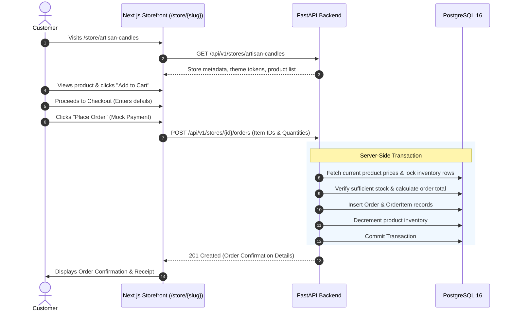

# 02 - User Journeys & Flows

## Merchant Journey (5–10 Minutes from Start to Publish)

```mermaid
journey
    title Merchant Onboarding & Launch Journey
    section Step 1: Sign Up
      Create account with email/password: 5: Merchant
    section Step 2: Answer Questionnaire
      Enter store name & category: 5: Merchant
      Pick brand vibe & tone: 5: Merchant
      Provide brief product idea: 5: Merchant
    section Step 3: AI Generation & Review
      AI drafts tagline, description, starter products: 5: SimpleStore
      Merchant reviews and edits draft products: 4: Merchant
    section Step 4: Visual Selection
      Choose pre-defined theme (Minimal, Editorial, Warm, Bold): 5: Merchant
      Live interactive preview: 5: Merchant
    section Step 5: Publish & Manage
      Click Publish Store: 5: Merchant
      Share live store URL: 5: Merchant
      Access minimal merchant dashboard: 5: Merchant
```

---

## Customer Journey (Zero-Friction Purchase)


