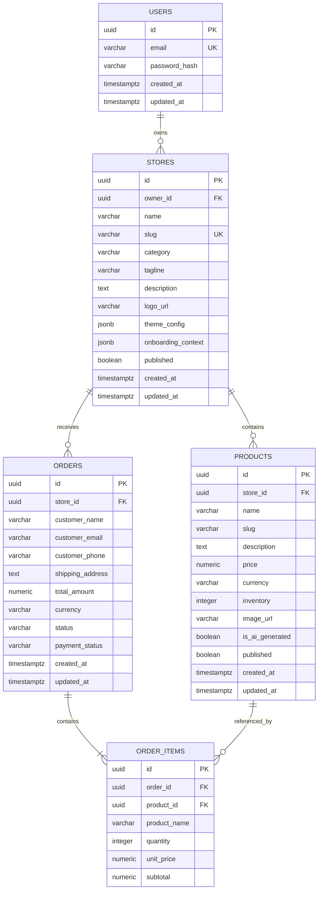

# 04 - Database Design & Schema Specification

## Database: PostgreSQL 16
SimpleStore relies on PostgreSQL as its primary source of truth, enforcing foreign key constraints, indexes, unique constraints, and ACID guarantees.

---

## 1. Entity-Relationship Diagram

---

## 2. Table Specifications & Indexes

### 2.1 `users`
- `id`: `UUID`, Primary Key, default `gen_random_uuid()`
- `email`: `VARCHAR(255)`, NOT NULL, UNIQUE, Indexed (btree)
- `password_hash`: `VARCHAR(255)`, NOT NULL
- `created_at`: `TIMESTAMPTZ`, default `now()`
- `updated_at`: `TIMESTAMPTZ`, default `now()`

### 2.2 `stores`
- `id`: `UUID`, Primary Key
- `owner_id`: `UUID`, NOT NULL, References `users(id)` ON DELETE CASCADE
- `name`: `VARCHAR(100)`, NOT NULL
- `slug`: `VARCHAR(100)`, NOT NULL, UNIQUE, Indexed (btree)
- `category`: `VARCHAR(100)`
- `tagline`: `VARCHAR(255)`
- `description`: `TEXT`
- `logo_url`: `VARCHAR(512)`
- `theme_config`: `JSONB`, NOT NULL (Default archetype tokens)
- `onboarding_context`: `JSONB` (Stores questionnaire responses)
- `published`: `BOOLEAN`, default `FALSE`, Indexed (btree)
- `created_at`, `updated_at`: `TIMESTAMPTZ`

### 2.3 `products`
- `id`: `UUID`, Primary Key
- `store_id`: `UUID`, NOT NULL, References `stores(id)` ON DELETE CASCADE, Indexed
- `name`: `VARCHAR(255)`, NOT NULL
- `slug`: `VARCHAR(255)`, NOT NULL
- `description`: `TEXT`
- `price`: `NUMERIC(10, 2)`, NOT NULL (Must be >= 0)
- `currency`: `VARCHAR(3)`, default `'USD'`
- `inventory`: `INTEGER`, NOT NULL, default 0 (Must be >= 0)
- `image_url`: `VARCHAR(512)`
- `is_ai_generated`: `BOOLEAN`, default `FALSE`
- `published`: `BOOLEAN`, default `TRUE`, Indexed
- `created_at`, `updated_at`: `TIMESTAMPTZ`
- **Constraint**: `UNIQUE(store_id, slug)`

### 2.4 `orders`
- `id`: `UUID`, Primary Key
- `store_id`: `UUID`, NOT NULL, References `stores(id)` ON DELETE RESTRICT, Indexed
- `customer_name`: `VARCHAR(255)`, NOT NULL
- `customer_email`: `VARCHAR(255)`, NOT NULL, Indexed
- `customer_phone`: `VARCHAR(50)`
- `shipping_address`: `TEXT`
- `total_amount`: `NUMERIC(10, 2)`, NOT NULL
- `currency`: `VARCHAR(3)`, default `'USD'`
- `status`: `VARCHAR(50)`, default `'pending'` (`pending`, `fulfilled`, `cancelled`)
- `payment_status`: `VARCHAR(50)`, default `'demo_paid'`
- `created_at`, `updated_at`: `TIMESTAMPTZ`

### 2.5 `order_items`
- `id`: `UUID`, Primary Key
- `order_id`: `UUID`, NOT NULL, References `orders(id)` ON DELETE CASCADE, Indexed
- `product_id`: `UUID`, References `products(id)` ON DELETE SET NULL
- `product_name`: `VARCHAR(255)`, NOT NULL *(Preserved historical snapshot)*
- `quantity`: `INTEGER`, NOT NULL (Must be > 0)
- `unit_price`: `NUMERIC(10, 2)`, NOT NULL *(Preserved historical price)*
- `subtotal`: `NUMERIC(10, 2)`, NOT NULL
